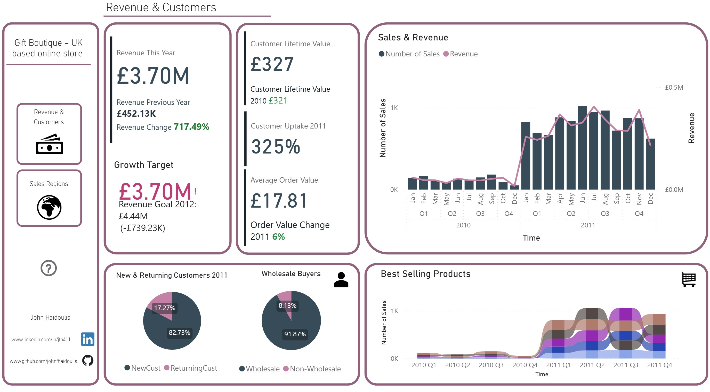
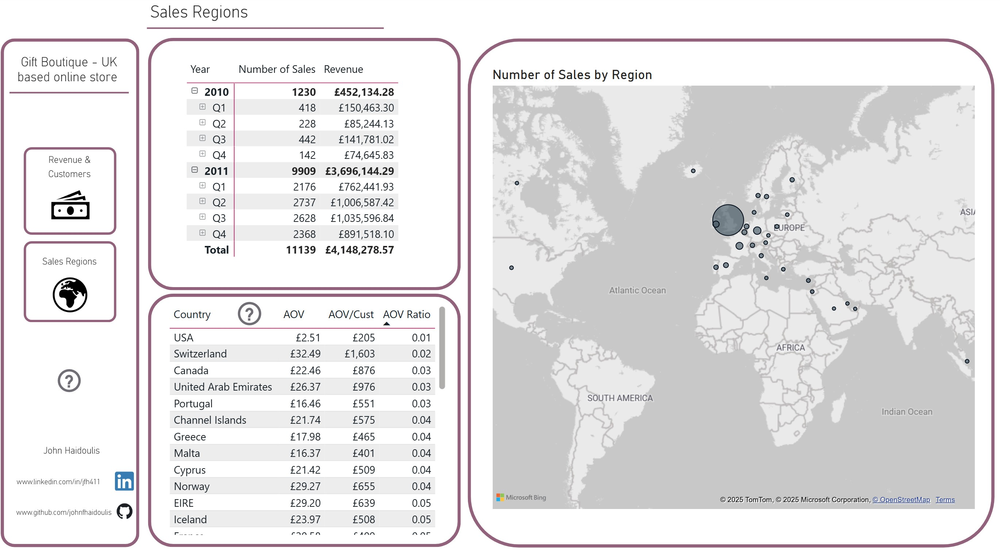

# Online Boutique Retailer

By John Haidoulis

## General Summary

Business Growth and Revenue Report.

## Scope

* This report is for the business managers of this boutique. It is to understand key business growth metrics and the causes for the surge in revenue and sales from 2010 to 2011
* The data contains invoice data from 25,000+ sales between 2010 and 2011.
* I set out to make two clear report pages. This report only focuses on revenue, product types, and location of sales data.

## Report and Insights

* The data was processed and optimised in Power BI Desktop.

### Revenue & Customers

* There was a 717% increase in revenue in 2011 from 2010 largely explained by the 325% uptake of customers (83% of which were new customers). However the amount each customer spent remained the same between years (Customer Lifetime value)
* There was also a modest 6% increase in average order value per customer in 2011.
* The top 5 selling product over each quarter is displayed, and although much more was sold than in 2010, there was not a significant percentage difference in the sale of this product between the two years. The boutique should focus advertising on these popular products, more specifically, focus advertising before the quarter when they sell the best (e.g. Jumbo Bag Retrosport - in the summer Q3 quarter)
* This business primarily focuses on selling to wholesale buyers suggesting a large increase in connections and deals with major suppliers for boutique items.

### Sales Regions

* As a UK-based online retailer, the UK was the main location where sales were made.
* Many countries did not make any purchases in 2010 suggesting the online retailer successfully managed to make international deals with wholesale retailers, however the largest proportion of new customers came from the UK.
* Countries like Australia, Netherlands, and Czech Republic have a low AOV/high per customer AOV (Relatively high ratio) suggesting more loyal buyers with smaller basket purchases. On the other hand, countries likes Switzerland, USA, and Canada has a high AOV/low per customer AOV (Relatively low ratio) which are low frequency, big purchase transactions. Given this is primarily a wholesale retailer, the business should focus sales and advertising in the low AOV ratio for bigger more efficient shipments and lower admin costs.

## Limitations

* To understand the rapid uptake of customers, it is important to have accesss additional data: Advertising changes (Click through rate & traffic source), SEO changes website traffic. This is because it is still unclear as to why there was a huge uptake in new customers.
* To further delve into the business health, it would have been benefical to know the business expenditure over time to calculate the profit margins.

### References:

* Data was derived from Kaggle which was uploaded by Bojan Tunguz

